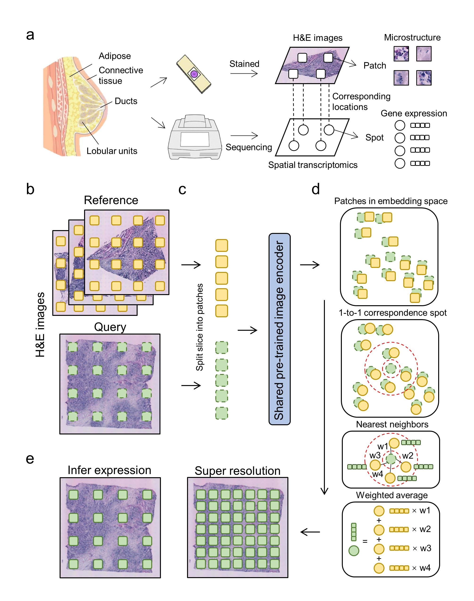

# stInfer

## Overview
Background: 
The rapid development of spatial transcriptomics (ST) technology has enabled the measurement of transcript abundance 
while simultaneously obtaining the cell spatial locations. However, the high cost has hindered its widespread adoption. 
Furthermore, commonly used ST platforms are often low-resolution, which restricts their utility in investigating 
intricate tissue structures. 

Methods: 
Here, we propose stInfer, a novel method that can infer gene expression in full transcriptomics range and enhance 
resolution in ST data using Hematoxylin and Eosin-stained (H&E) images. Specifically, H&E images can be segmented into 
patches according to the corresponding spot locations. Then a pre-trained visual model is applied to encode these 
patches into feature vectors. Finally, the gene expression of the target spot can be predicted by weighted K-Nearest 
Neighbors (KNN) algorithm. 

Results: 
We evaluated stInfer in expression prediction and super-resolution tasks. Comprehensive results on breast cancer 
datasets demonstrates the effectiveness of the proposed method. In summary, stInfer is a powerful and lightweight tool 
that can infer gene expression from H&E images. It holds great promise for being widely applied to complex ST data to 
bring novel insights to structural compositions and microenvironments. 
Keywords: 
spatial transcriptomes, H&E image, expression inference, super resolution 




## Doc
TODO
## Prerequisites

### Data

TODO
### Environment

It is recommended to use a Python version  `3.9`.
* set up conda environment for stInfer:
```
conda create -n stInfer python==3.9
```

```
conda activate stInfer
```

* You need to choose the appropriate dependency pytorch and dgl for your own environment, 
and we recommend the following pytorch==1.13.1 and dgl==0.9.0 with cudatoolkit==11.6:
```
conda install cudatoolkit=11.6 -c conda-forge
pip install torch==1.13.1+cu116 torchvision==0.14.1+cu116 torchaudio==0.13.1 --extra-index-url https://download.pytorch.org/whl/cu116
pip install dgl-cu116 -f https://data.dgl.ai/wheels/repo.html
```
The other versions of pytorch and dgl can be installed from
[torch](https://pytorch.org/) and [dgl](https://www.dgl.ai/pages/start.html).


## Installation
You can install stInfer as follows:
```
TODO
```

## Tutorials
The following are detailed tutorials. All tutorials were carried out on a notebook with a 11800H cpu and a 3070 8G gpu.

1. [1OldST.ipynb](./1OldST.ipynb).

Reference:
TODO